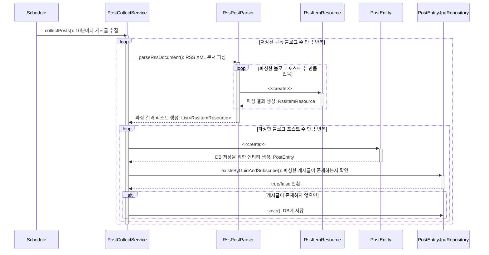
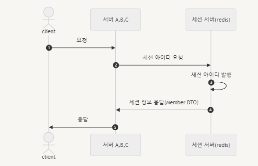

# RSS-Reader
파리지옥 템플릿에 사용될 Rss Reader를 만드는 저장소입니다.

---
## 프로젝트 소개
- 배포 URL :
- API Swagger :
- 진행기간 : 2023. 11 ~ 진행 중
- 팀 블로그: 
> RSS-Reader는 사용자가 여러 블로그 플랫폼을 구독하여 원하는 Feed를 볼 수 있고 서로 반응을 나눌 수 있는 플랫폼 서비스입니다.

---
## 팀원 소개
<table>
 <tr>
    <td align="center"><a href="https://github.com/jinny-l"></td>
    <td align="center"><a href="https://github.com/new-pow"></td>
    <td align="center"><a href="https://github.com/crtEvent"></td>
    <td align="center"><a href="https://github.com/leegyeongwhan"></td>
    <td align="center"><a href="https://github.com/jaea-kim"></td>
  </tr>
  <tr>
    <td align="center"><a href="https://github.com/jinny-l"><b>jinny-l</b></td>
    <td align="center"><a href="https://github.com/new-pow"><b>new-pow</b></td>
    <td align="center"><a href="https://github.com/crtEvent"><b>crtEvent</b></td>
    <td align="center"><a href="https://github.com/leegyeongwhan"><b>leegyeongwhan</b></td>
    <td align="center"><a href="https://github.com/jaea-kim"><b>jaea-kim</b></td>
  </tr>
</table>

<br/>

---

## 기술스택, 및 개발환경


   


- 디자인 :
- 코드 컨벤션 :
- 브랜치 전략 :
- 스크럼 회의록:

---
## 레이어 구조
```
        📂 config
        📂 global
            📂 utill
        📂 domian
         📂 ...{domain_name}
            🟢 {domain_name}.java
        📂 exception
            🟢 GlobalHttpExceptionHandler
            🟢 ErrorObject
            🟢 NoSuchElementException ...
        📂 presentation
            📂 controller
            📂 dto
            📂 docs // swagger custom annotation
        📂 service
        📂 infrastructure
            📂 entity
                📂 ...{domain_name}
                    🟢 {domain_name}Entity.java
        📂 repository
        📂 api
```

---

## 인프라 구조

//topdo: 인프라 구조도 추가

---
## 프로젝트 설치 및 실행 방법
**요구사항**
애플리케이션을 구축하고 실행하려면 다음이 필요합니다.
- Java 17
- Spring Boot 3.0.0 이상

설치
```
$ git clone https://github.com/FlytrapHub/RSS-Reader.git
$ cd rss-reader
```

백엔드 로컬 실행 예시
```
yml 파일 자신에게 맞게 수정 후

./gradlew build

docker build -t {gamja123/boards} .

docker docker-compose up
```
---
## 사용 방법
//todo: 도영상 촬영

---
## 프로젝트 구조
### 주요 서비스 시퀀스 다이어 그램






---
### 목차
//TODO: 프로젝트의 주요 서비스 구조를 추가
- Scheduler를 통한 Post 크롤링 작업
- CI/CD
---

## 기타

---
