# RSS-Reader
파리지옥 템플릿에 사용될 Rss Reader를 만드는 저장소입니다.

---
## 프로젝트 소개
- 배포 URL :
- 진행기간 : 2023. 11 ~ 진행 중
- [Postman Publish Link](https://documenter.getpostman.com/view/31047574/2s9YsDmb8v)
- [팀 블로그](https://flytrap-dev.tistory.com/)

> RSS-Reader는 사용자가 여러 블로그 플랫폼을 구독하여 원하는 Feed를 볼 수 있고 서로 반응을 나눌 수 있는 플랫폼 서비스입니다.
실제로 굉장히 잘 구축되어있는 웹서비스 feedly 를 레퍼런스로 우리가 직접 쓰기 위한 작은 서비스를 구현하고 싶어 여러 기능을 구현 했습니다.
[프로젝트 소개 글](https://flytrap-dev.tistory.com/5)

### 사용법
//TODO: 이미지 추가, 사용방법 추가

---

## 기술스택, 및 개발환경

   


- [디자인](https://flytrap.notion.site/69f7ecb5dfc5490cbc2389d4b4bd49c7?pvs=4)
- [컨벤션](https://flytrap.notion.site/BE-0c6637bdeaa1408b9998467e525033fb?pvs=4)
- [브랜치 전략, 및 PR 템플릿](https://flytrap.notion.site/GitHub-b3f73e8928ef4b4d931c6f7fc692b0ed?pvs=4)

---

## 프로젝트 주요 기능
- 깃허브 **로그인**을 통해 로그인할 수 있습니다.
- 회원은 **폴더** 만들고, 삭제, 수정, 조회할 수 있습니다.
- 회원은 폴더에 블로그를 **구독** 할 수 있습니다.
  - 개인 폴더, **공유 폴더** 두 가지가 있습니다.
- 사용자는 북마크를 추가, 삭제, 수정, 조회할 수 있습니다.
- 사용자는 공유 폴더 안에 있는 포스트만 **리액션**을 추가, 삭제할 수 있습니다.
- 사용자가 구독한 폴더에 새 글이 올라오면 **알림**을 받을 수 있습니다.
- Rss-Reader는 Scheduler을 통한 구독을 기준으로 포스트 크롤링 작업을 합니다.
---

## 레이어 구조
```
      
        📂 domian
            📂 {domain_name} // 도메인 별로 패키지 생성
                🟢 {domain_name}.java
        📂 global
            📂 config // 설정 파일
            📂 event  // AOP 관련 이벤트 파일
            📂 exception // 예외 헨들러, 처리
                🟢 GlobalHttpExceptionHandler.java
                🟢 ErrorObject.java
                🟢 NoSuchElementException ... .java
            📂 model // 공통 Response응답 값과, 도메인의 요소들
        📂 presentation
            📂 controller
                 🟢 {domain_name}Controller.java
            📂 dto
            📂 docs // swagger custom annotation
        📂 infrastructure
            📂 api // Parser, OauthProvider등 외부 API 호출 관련 클래스
                📂 dto
            🟢 AuthProvider.java
            🟢 RssPostParser.java
            📂 entity
                📂 ...{domain_name}
                    🟢 {domain_name}Entity.java
            📂 properties // application.yml 파일에 작성한 값들을 가져오는 패키지
            📂 repository
        📂 service
            📂 dto
       
```

---

## 인프라 구조

## CI/CD 구조
//todo : CI/CD 방법 추가
---

## 프로젝트 설치 및 실행 방법
**요구사항**
애플리케이션을 구축하고 실행하려면 다음이 필요합니다.
- Java 17
- Spring Boot 3.0.0 이상

설치
```
$ git clone https://github.com/FlytrapHub/RSS-Reader.git
$ cd rss-reader
```

---

## 프로젝트 구조

### ERD 다이어 그램


---
### 주요 서비스 시퀀스 다이어 그램

```mermaid
sequenceDiagram
  participant Schedule
  participant PostCollectService
  participant RssPostParser
  participant RssItemResource
  participant PostEntity
  participant PostEntityJpaRepository

  Schedule ->> PostCollectService: collectPosts(): 10분마다 게시글 수집
  activate PostCollectService
  loop 저장된 구독 블로그 수 만큼 반복
    PostCollectService ->>+ RssPostParser: parseRssDocument(): RSS XML 문서 파싱
    loop 파싱한 블로그 포스트 수 만큼 반복
      RssPostParser ->>+ RssItemResource: <<create>>
      RssItemResource -->>- RssPostParser: 파싱 결과 생성: RssItemResource
    end
    RssPostParser -->>- PostCollectService: 파싱 결과 리스트 생성: List<RssItemResource>
    loop 파싱한 블로그 포스트 수 만큼 반복
      PostCollectService ->>+ PostEntity: <<create>>
      PostEntity -->>- PostCollectService: DB 저장을 위한 엔티티 생성: PostEntity
      PostCollectService ->>+ PostEntityJpaRepository: existsByGuidAndSubscribe(): 파싱한 게시글이 존재하는지 확인
      PostEntityJpaRepository -->>- PostCollectService: true/false 반환
      alt 게시글이 존재하지 않으면
        PostCollectService ->> PostEntityJpaRepository: save(): DB에 저장
      end
    end
  end
  deactivate PostCollectService
```

- Post 수집 서비스 시퀀스 다이어그램


- Login 서비스 시퀀스 다이어그램

```mermaid
sequenceDiagram
    autonumber
    actor A as client
    participant B as 서버 A,B,C
    participant C as 세션 서버(redis)
    A->>B: 요청
		B->>C: 세션 아이디 요청
		C->>C: 세션 아이디 발행
		C->>B: 세션 정보 응답(Member DTO)
		B->>A: 응답
```

---


## 팀원 소개
<table>
 <tr>
    <td align="center"><a href="https://github.com/jinny-l"></td>
    <td align="center"><a href="https://github.com/new-pow"></td>
    <td align="center"><a href="https://github.com/crtEvent"></td>
    <td align="center"><a href="https://github.com/leegyeongwhan"></td>
    <td align="center"><a href="https://github.com/jaea-kim"></td>
  </tr>
  <tr>
    <td align="center"><a href="https://github.com/jinny-l"><b>jinny-l</b></td>
    <td align="center"><a href="https://github.com/new-pow"><b>new-pow</b></td>
    <td align="center"><a href="https://github.com/crtEvent"><b>crtEvent</b></td>
    <td align="center"><a href="https://github.com/leegyeongwhan"><b>leegyeongwhan</b></td>
    <td align="center"><a href="https://github.com/jaea-kim"><b>jaea-kim</b></td>
  </tr>
</table>

<br/>

---
## 기타

---
